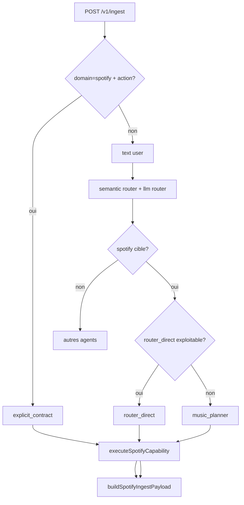

# Music Actions - Detection, Routing, Execution, Response

## Review Status

- [ ] Reviewed with user: pipeline global
- [ ] Reviewed with user: determinisme
- [ ] Reviewed with user: E2 actions
- [ ] Reviewed with user: E1 actions
- [ ] Reviewed with user: action non-semantique like_track

Objectif: donner une vue complete pour chaque action Spotify:
- comment Jarvis la detecte,
- quel chemin de routing est applique,
- comment elle est executee techniquement,
- ce que Jarvis repond (ack execution vs information utilisateur).

## 1) Pipeline global (ordre reel)

1. Entree explicite prioritaire
- Condition: payload contient `domain=spotify` + `action` valide.
- Route: `explicit_contract`.
- Effet: execute directement `executeSpotifyCapability(...)` sans passer par le routeur LLM/HA.
- Reference: [src/routes/ingest.ts](src/routes/ingest.ts#L956).

2. Sinon, entree textuelle
- Jarvis tente d'abord la voie semantique (E2/E1) puis le routeur LLM.
- Si cible Spotify:
  - `router_direct` si action directe exploitable (et cas special `search_and_play` avec query deja presente).
  - `music_planner` sinon (planificateur musique OpenAI).
- References:
  - [src/routes/ingest.ts](src/routes/ingest.ts#L1998)
  - [src/routes/ingest.ts](src/routes/ingest.ts#L2006)
  - [src/routes/ingest.ts](src/routes/ingest.ts#L2246)

3. Construction de la reponse uniforme
- Reponse Spotify normalisee via `buildSpotifyIngestPayload(...)`.
- Champs utiles:
  - `replyMeta.kind = spotify`
  - `replyMeta.routeKey = spotify.<action_executee>`
  - `replyMeta.fallbackReason = execution_error` si statut error
  - `music.routing.path = explicit_contract | router_direct | music_planner`
  - `music.execution.status = success | need_clarification | error`
- Reference: [src/routes/ingest.ts](src/routes/ingest.ts#L208).

## 2) Determinisme (ce qui est stable et non ambigu)

1. Determinisme de priorite
- Le contrat explicite Spotify gagne toujours sur tout le reste.
- Reference: [src/routes/ingest.ts](src/routes/ingest.ts#L956).

2. Determinisme de decision semantique
- E2: actions directes sans planner.
- E1: actions qui passent par planner quand elles viennent du semantique.
- Reference:
  - [src/routing/semanticRouteCatalog.ts](src/routing/semanticRouteCatalog.ts#L58)
  - [src/routing/semanticRouteCatalog.ts](src/routing/semanticRouteCatalog.ts#L225)

3. Determinisme de fallback textuel Spotify
- `search_and_play` sans query exploitable: bascule planner.
- `search_and_play` sans cible resolue: gate de reprise generique (`play`) sinon clarification.
- Reference: [src/spotify/spotifyExecutor.ts](src/spotify/spotifyExecutor.ts#L897).

4. Determinisme d execution (no-op / messages fixes)
- Plusieurs actions ont des reponses no-op stables (ex: deja en pause, deja au volume cible).
- Reference: [src/spotify/spotifyExecutor.ts](src/spotify/spotifyExecutor.ts#L348).

## 3) Mapping action par action

Legende:
- Niveau detection: E2 (direct), E1 (planner requis en semantique), none (hors semantique)
- Reponse type:
  - `EXEC_ACK`: confirmation d execution
  - `INFO`: retour informatif pour l utilisateur
  - `CLARIFY`: manque d information, demande de precision

### 3.1 E2 (direct quand detection semantique)

#### Action: `pause`
- Detection:
  - Explicite: `domain=spotify, action=pause`
  - Semantique: `spotify.pause` (E2)
  - Matrix: planner non requis
- Execution:
  - verifie lecture courante (`getNowPlaying`)
  - no-op si deja pause / rien en cours
  - sinon `pause(deviceId?)`
- Reponse:
  - `EXEC_ACK`: `En pause.`
  - ou no-op informatif: `Deja en pause.` / `Rien ne joue actuellement.`
- References:
  - [src/spotify/musicRoutingMatrix.ts](src/spotify/musicRoutingMatrix.ts#L17)
  - [src/spotify/spotifyExecutor.ts](src/spotify/spotifyExecutor.ts#L348)

#### Action: `play`
- Detection:
  - Explicite ou semantique E2 `spotify.play`
- Execution:
  - tente de recuperer device courant via `getNowPlaying`
  - execute `play(targetDevice?)`
- Reponse:
  - `EXEC_ACK`: `Lecture reprise.`
  - erreur contexte device possible (`spotify n est pas ouvert...`)
- References:
  - [src/spotify/musicRoutingMatrix.ts](src/spotify/musicRoutingMatrix.ts#L26)
  - [src/spotify/spotifyExecutor.ts](src/spotify/spotifyExecutor.ts#L380)

#### Action: `next`
- Detection: explicite ou E2 `spotify.next`
- Execution: `next(deviceId?)`
- Reponse: `EXEC_ACK` (`Piste suivante.`)
- References:
  - [src/spotify/musicRoutingMatrix.ts](src/spotify/musicRoutingMatrix.ts#L35)
  - [src/spotify/spotifyExecutor.ts](src/spotify/spotifyExecutor.ts#L403)

#### Action: `previous`
- Detection: explicite ou E2 `spotify.previous`
- Execution: `previous(deviceId?)`
- Reponse: `EXEC_ACK` (`Piste precedente.`)
- References:
  - [src/spotify/musicRoutingMatrix.ts](src/spotify/musicRoutingMatrix.ts#L44)
  - [src/spotify/spotifyExecutor.ts](src/spotify/spotifyExecutor.ts#L411)

#### Action: `now_playing`
- Detection: explicite ou E2 `spotify.now_playing`
- Execution: `getNowPlaying()`
- Reponse: `INFO` (`En cours : <titre>.`) + payload `now_playing`
- References:
  - [src/spotify/musicRoutingMatrix.ts](src/spotify/musicRoutingMatrix.ts#L53)
  - [src/spotify/spotifyExecutor.ts](src/spotify/spotifyExecutor.ts#L328)

#### Action: `list_devices`
- Detection: explicite ou E2 `spotify.list_devices`
- Execution: `listDevicesPublic()`
- Reponse: `INFO` (`<n> appareil(s) disponible(s).`) + liste devices
- References:
  - [src/spotify/musicRoutingMatrix.ts](src/spotify/musicRoutingMatrix.ts#L62)
  - [src/spotify/spotifyExecutor.ts](src/spotify/spotifyExecutor.ts#L311)

#### Action: `clear_queue`
- Detection: explicite ou E2 `spotify.clear_queue`
- Execution: `clearQueue(deviceId?)`
- Reponse:
  - `EXEC_ACK` (`x titres retires de la file.`)
  - no-op possible (`File deja vide.`)
- References:
  - [src/spotify/musicRoutingMatrix.ts](src/spotify/musicRoutingMatrix.ts#L71)
  - [src/spotify/spotifyExecutor.ts](src/spotify/spotifyExecutor.ts#L1012)

### 3.2 E1 (planner requis en semantique)

#### Action: `search`
- Detection:
  - Explicite direct, ou semantique E1 `spotify.search` puis planner
- Execution:
  - `searchCatalog(...)` (type auto ou force)
  - classement top track possible (`searchTopTrackUri`)
- Reponse:
  - `INFO`: resume resultats + options + grouped results
  - `CLARIFY` si query absente
- References:
  - [src/spotify/musicRoutingMatrix.ts](src/spotify/musicRoutingMatrix.ts#L80)
  - [src/spotify/spotifyExecutor.ts](src/spotify/spotifyExecutor.ts#L497)

#### Action: `search_and_play`
- Detection:
  - Explicite direct possible
  - E1 semantique avec planner
  - router direct autorise seulement si query deja exploitable
- Execution:
  - lecture directe par URI/context si fourni
  - sinon recherche + selection + `playUris`/`playContextUri`
  - fallback reprise generique (`play`) si gate active
- Reponse:
  - `EXEC_ACK`: `Lecture de ...`
  - `CLARIFY` si cible manquante
- References:
  - [src/spotify/musicRoutingMatrix.ts](src/spotify/musicRoutingMatrix.ts#L89)
  - [src/routes/ingest.ts](src/routes/ingest.ts#L1989)
  - [src/spotify/spotifyExecutor.ts](src/spotify/spotifyExecutor.ts#L849)

#### Action: `queue_add`
- Detection: explicite ou E1 `spotify.queue_add` + planner
- Execution:
  - resolve track URI (directe ou recherche + selection)
  - `addToQueueUri(...)`
- Reponse:
  - `EXEC_ACK`: `Ajoute a la file.`
  - `CLARIFY` si query manquante
- References:
  - [src/spotify/musicRoutingMatrix.ts](src/spotify/musicRoutingMatrix.ts#L98)
  - [src/spotify/spotifyExecutor.ts](src/spotify/spotifyExecutor.ts#L683)

#### Action: `transfer`
- Detection: explicite ou E1 `spotify.transfer` + planner
- Execution:
  - examine now playing/device courant
  - no-op si deja sur cible
  - sinon `transferPlayback(device, play)`
  - cas sans playback: tentative `play(device)`
- Reponse:
  - `EXEC_ACK`: `Lecture transferee.` / `Lecture lancee.`
  - no-op: `Deja en lecture sur cet appareil.`
- References:
  - [src/spotify/musicRoutingMatrix.ts](src/spotify/musicRoutingMatrix.ts#L107)
  - [src/spotify/spotifyExecutor.ts](src/spotify/spotifyExecutor.ts#L612)

#### Action: `add_to_playlist`
- Detection: explicite ou E1 `spotify.add_to_playlist` + planner
- Execution:
  - resolve playlist (id ou nom)
  - resolve track(s) (uris ou query)
  - `addUrisToPlaylist(...)`
- Reponse:
  - `EXEC_ACK`: `Ajoute a la playlist.`
  - `CLARIFY` si playlist/titre manquant
- References:
  - [src/spotify/musicRoutingMatrix.ts](src/spotify/musicRoutingMatrix.ts#L116)
  - [src/spotify/spotifyExecutor.ts](src/spotify/spotifyExecutor.ts#L778)

#### Action: `volume_set`
- Detection: explicite ou E1 `spotify.volume_set` + planner
- Execution:
  - gere absolu (`volume_percent`) et relatif (`volume_delta`)
  - heuristique "moitie" via texte
  - no-op si deja au volume cible
  - `setVolume(...)`
- Reponse:
  - `EXEC_ACK`: `Volume : X%.`
  - no-op: `Volume deja a X%.`
  - `CLARIFY/ERROR` si contexte insuffisant
- References:
  - [src/spotify/musicRoutingMatrix.ts](src/spotify/musicRoutingMatrix.ts#L125)
  - [src/spotify/spotifyExecutor.ts](src/spotify/spotifyExecutor.ts#L419)

### 3.3 Non semantique

#### Action: `like_track`
- Detection:
  - explicite direct
  - matrix `semanticLevel = none` (pas de route semantique dediee)
- Execution:
  - `likeTrack(trackId?)` ou `unlikeTrack(trackId?)` selon `slots.state`
- Reponse:
  - `EXEC_ACK`: `Ajoute aux favoris.` / `Retire des favoris.`
- References:
  - [src/spotify/musicRoutingMatrix.ts](src/spotify/musicRoutingMatrix.ts#L134)
  - [src/spotify/spotifyExecutor.ts](src/spotify/spotifyExecutor.ts#L764)

## 4) Ce qui est "execution pure" vs "retour info"

Actions principalement execution + confirmation (`EXEC_ACK`):
- `pause`, `play`, `next`, `previous`, `volume_set`, `transfer`, `queue_add`, `search_and_play`, `add_to_playlist`, `like_track`, `clear_queue`

Actions principalement informatives (`INFO`):
- `list_devices`, `now_playing`, `search`

## 5) Ou regarder dans le code

- Contrat actions: [src/spotify/contracts.ts](src/spotify/contracts.ts#L3)
- Registry capability: [src/spotify/capabilityRegistry.ts](src/spotify/capabilityRegistry.ts)
- Matrix detection/routing: [src/spotify/musicRoutingMatrix.ts](src/spotify/musicRoutingMatrix.ts)
- Routes semantiques E2/E1: [src/routing/semanticRouteCatalog.ts](src/routing/semanticRouteCatalog.ts#L58)
- Execution par action: [src/spotify/spotifyExecutor.ts](src/spotify/spotifyExecutor.ts#L311)
- Construction payload final: [src/routes/ingest.ts](src/routes/ingest.ts#L208)
